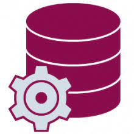

<h1 align="center">Nuthapon Sripornprasert 😆</h1>

<h2>ABOUT ME 👋</h2>

Hi, My name is Nathapon Sripornprasert. Nickname is Ax. I am IoT Engineering 👩🏿‍💻. I have been working in 2 years. I graduated from Kasetsart University Kampaheng Saen Campus, Bachelor degree of industrial engineering 👨‍🎓. I create project to support in production process of the company. In my free time, I are dedicated for learning program coding and backend of website application

<h2>PROFILE</h2>

<li>Date of Birth: 9th June 1995</li>
<li>Gender: Male</li>
<li>National: Thai</li>
<li>Marital Status: Single</li>
<li>Contract
  <ul>
    <dd>Phone no: 090-728-9242</dd>
    <dd>Email: nuthaponsri@gmail.com</dd>
    <dd>Line: ax_dee</dd>
  </ul>
</li>
  
<h2>WORK EXPERIENCE</h2>
<b>Fujikura Electronics (Thailand) Ltd.  (IoT Engineering)</b>

June, 2018 – Present

    <li>I am Internet of Things Engineering</li>
    <li>Design PL/SQL Database</li>
    <li>Design Python user interface and script</li>
    <li>Build VB program language to upload data automatically</li>
    <li>Design Data Visualization</li>

<h2>PROJECT EXPERIENCE</h2>

  <b>Home_service Website (Software Park Camp: Python Full Stack Developer)</b> 
  Responsibility: Python Backend Developer (Django)
    <li>Design <a href="picture/ERD Diagram.png">Entity Relation Diagram</a></li>
    <li>Design <a href="picture/Architecture.png">Django architecture</a></li>
    <li>Load initial data into Django tables</li>
    <li>Write Django Models for create database in Postgres SQL</li>
    <li>Make Serializer of all model</li>
    <li>Create All API Function in Home Service (Using Serializer to run query)</li>
    <li>Create Json Web Token for login webpage</li>

 

<b>SPC Data Visualization</b> 
Design Quality Graph in IoT Online Report
   <li>Design PL/SQL Database</li>
   <li>Write VB program (POST database, send Outlook mail)</li>
   <li>Create SQL query to design Data Visualization</li>

 

<b>Cross Section Excel Report</b> 
Design Cross Section Report from machine
   <li>Design Tkinter Library to design user interface</li>
   <li>Make the excel report via Openpyxl library</li>

 

<b>Count Duplicate</b> 
Design user interface to report duplicate fixture
   <li>Use Tkinter Library to design user interface</li>
   <li>Report fixture duplicate in CSV file</li>

<h2>TRAINING AND CERTIFICATE</h2>
<b>OFFLINE FullStack Python For Web Developer, Software Park Camp 

&nbsp;&nbsp;Learn Python Backend Developer (Django, Postgres SQL, Python)

<b>COMPLETE PYTHON 3 PROGRAMING, BornToDev Coding Academy 

&nbsp;&nbsp;Learn Basic Python program language and library

<h2>LANGUAGE AND TOOLS</h2>
<code></code>
<code></code>
<code></code>
<code></code>
<code></code>
<code></code>
<code></code>
<code></code>

<h2>GITHUB STATS</h2>

